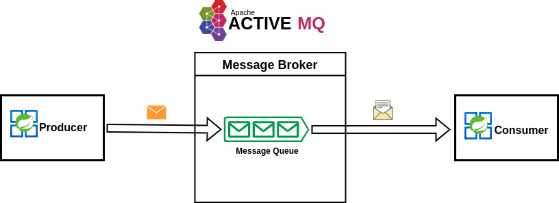

# Active Artemis Producer Service

Spring boot application that produces messages to the Queue.

_This project is based on the medium article
<a href="https://medium.com/@denisgikundi05/asynchronous-messaging-simplified-exploring-apache-activemq-artemis-with-spring-boot-7d20814a1243"> Asynchronous Messaging Simplified: Exploring Apache ActiveMQ Artemis with Spring Boot </a>_

# Architecture Design

 <br />
<div align="center">
  <a href="https://medium.com/@denisgikundi05/asynchronous-messaging-simplified-exploring-apache-activemq-artemis-with-spring-boot-7d20814a1243">
    
  </a>

</div>

# Tech Stack

1. Java Spring Boot
2. Active MQ Artemis

### Spring Boot Dependency

   ```sh

<dependency>
     <groupId>org.springframework.boot</groupId>
     <artifactId>spring-boot-starter-artemis</artifactId>
</dependency>

   ```


### Application Properties

   ```sh
server.port=8086
spring.artemis.mode=native
spring.artemis.broker-url=tcp://localhost:61616
spring.artemis.user=artemis
spring.artemis.password=artemis

   ```
